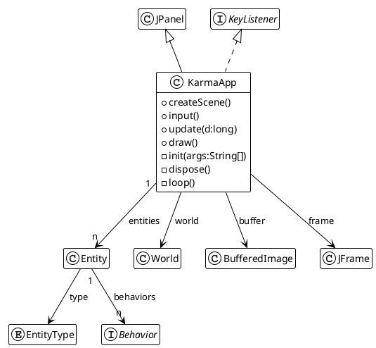

# README

## Context

This is the readme file for **Karma (1.0.0)** project.
A game oriented java project proposing basic implementation for

- `Entity` as game objects,
- Physic engine computation based on a `World` context
- and key input processing.
- Some `Behavior` can be added to the `Entity` to process some common behaviors.

## Description

The project is composed of one main class `KarmaApp` that contains sub classes.



## Build

To build the project, just execute the following command line :

```bash
./build.sh a
```

## Run

To execute the build project, just run it with :

```bash
./build.sh r
```

you can execute the command line :

```bash
java -jar target/Karma-1.0.0.jar
```

or on linux machine, or git-bash on Windows :

```bash
target/build/Karma-1.0.0.run
```

## Contribute

You can change the source code freely and add/or new build dependencies through the `build/properties` file, see the [build.readme.md](./build.readme.md) file for details.

Enjoy !

Frédéric Delorme.
