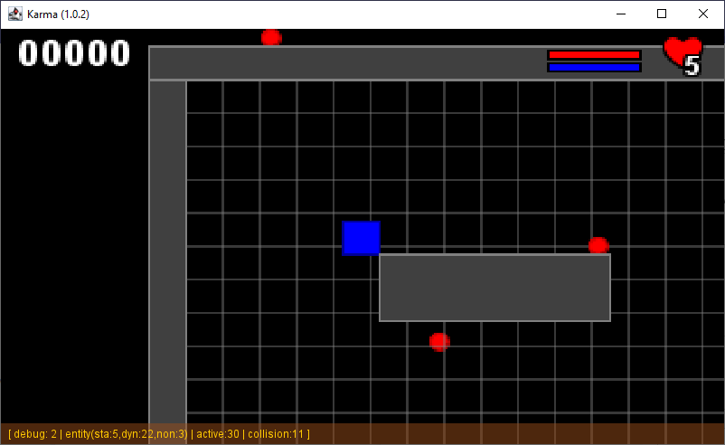

# Karma Platform

The KarmaPlatform is a compact and easy to user 2D platform framework to defvelop very si;ple game with the JDK only.

0. [Introduction](00-introduction.md)
1. [Main class Application](01-main_class_app.md)
2. [About the rendering](02-about_the_rendering.md)
3. [Entity](03-entity.md)
4. [Adding text object](04-adding_text_object.md)
5. [The Scene](05-the_scene.md)
6. [Add child to Entity](06-add_child_to_entity.md)
7. [Collision and Response](07-collision_and_response.md)
8. [Add a Camera](08-add_camera.md)
9. [Add some platforms](09-add_platforms.md)
10. [World Disturbance](10-add_world_perturbations.md)

McG.
