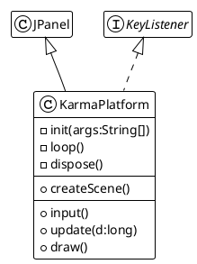

# Introduction

This Java project proposes an implementation of some basic Game mechanism to develop a
pixel-oriented platform game.

The game is built upon a main `KarmaPlatform` class and some subclasses :

- `Entity` implementing the default game object the game engine will manage.
- `World` define the world context for the game physic computation, defining the play area and the gravity.

It also provides helpers like:

- `EntityType` defining if an `Entity` is a graphic Rectangle of an Ellipse, for rendering purpose,
- `Behavior` is an interface to implement specific behavior on `Entity` for update, draw and input process.

The `KarmaPlatform` rely on the triptych "input/update/draw" game loop, and provide also some key methods
to initialize and release things.

The main class extends the JPanel AWT component and implements the `KeyListener`
to manage keyboard interactions.

_figure 0.1 - The KarmaPlatform main class_
