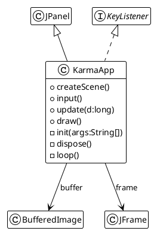
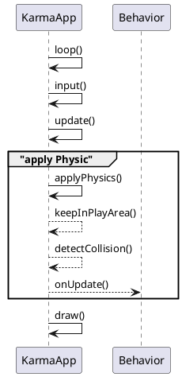

# The main Application class

The `KarmaApp` class is the main class for our game. It will manage the game loop, and also the display through a
windows and the buffered strategy to render this display.

A `JFrame` component from the Swing java API is used to create a Window. The `KarmaApp` will inherit from a `JPanel`
component to facilitate the window sizing accordingly to the defined size in the configuration properties file.

To render the game objects, we will use a buffer strategy to first draw all game objects onto an image buffer, and then
copy this buffer to a 3-layer `JFrame` buffer. At rendering time, we first draw then swap one of the three buffers.



The `init(String[])` method is loading a default configuration from a properties file (config.properties) and overload
it with possible matching arguments from the java command line

> **Configuration loading**<BR/>
> see `loadConfiguration()`, parseCLI(String[]) and `parseArguments(List<String>)` for implementation details.


Then, `createScene()` creates the game object composing the game scene, populating the `entities` list.

And finally, the `loop()` method will sustain the game loop, calling step by step:

- `input()`, to manage keyboard input
- `update(long)` to update all entities, sorted on their priority value,
- `draw()` to draw every active Entity on the rendering buffer, sorted on their priority value,

and looping.

## Applying physic and mechanic laws

The `update` method processing is the most complex, because this is where all the physic computation are performed.



the `applyPhysics()` first executes the first Newton law about speed on each Entity.

```text
entity position  = entity position + entity velocity * elapsed time
```

then update the bounding box for the concerned entity

And then apply some material concerned factors:

```text
entity velocity = entity velocity * entity friction
```

keeps the Entity constrained into the play area defined in the `World` object
with the `keepInPlayArea(World, Entity)`, and update again the bounding box (if required).

On some border collision, apply an elasticity material factor to compute the resulting velocity:

```java
private void keepInPlayArea(World w, Entity e) {
    Rectangle2D playArea = w.getPlayArea();
    if (!playArea.contains(e.box)) {
        if (e.x < playArea.getX()) {
            e.dx = e.dx * -e.getElasticity();
            e.x = playArea.getX();
        }
        // doing the same test on all other sides... 
        e.updateBox();
    }
}
```

And finally, try and detect collision between the concerned Entity and all others, and compute resulting velocity:

```text
entity velocity = max (entity velocity and other entity velocity) 
    * -max(entity elasticity and other entity elasticity)
```

```java
private void detectCollision(World w, Entity e) {
    entities.values().stream().filter(o -> e.isActive() && o.isActive() && !o.equals(e)).forEach(o -> {
        if (e.box.intersects(o.box) || e.box.contains(o.box)) {
            e.dx = Math.max(o.dx, e.dx) * -Math.max(e.getElasticity(), o.getElasticity());
            e.dy = Math.max(o.dy, e.dy) * -Math.max(e.getElasticity(), o.getElasticity());
        }
    });
}
```

