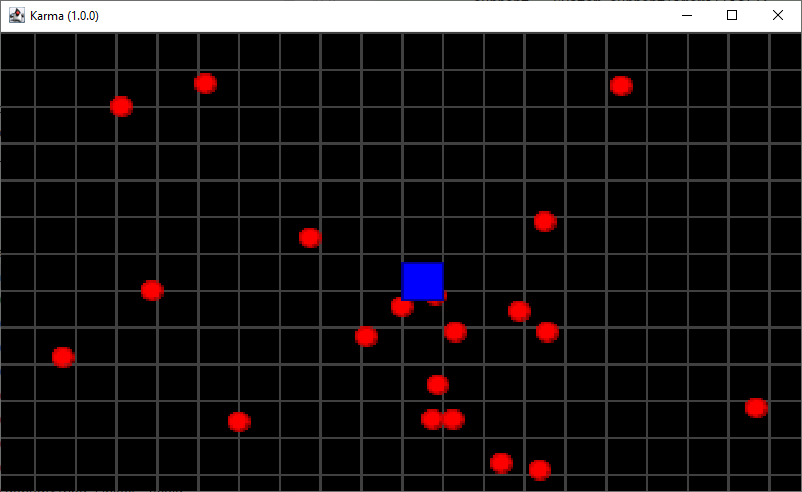

# About the Rendering

A game would be nothing without a good rendering pipeline.

We will use here something basic as we target 2D platform/arcade game. Keep using the JDK with
the good old AWT/Swing APIs.

Basically, a game window is first rendered through a 'rasterization' buffer, and then this buffer is copied to
the window bitmap. The window itself will support a buffer strategy to avoid flickering effect.

This is why a BufferedImage and JFrame are used to display our game.

```java
public class KarmaApp extends JPanel implements KeyListener {
    //...
    private JFrame frame;
    private BufferedImage buffer;
    //...
}
```

## Drawing process

The game window will be displayed by drawing some Entity game objects. The Entity's list of entities is filtered on
active entity only, and is sorted
according to their priority value.

The buffer is prepared for antialiasing processing `<1>`, and cleared `<2>`.

```java
public class KarmaApp extends JPanel implements KeyListener {
    //...

    public void draw() {
        // <1> prepare buffer
        Graphics2D g = buffer.createGraphics();
        g.setRenderingHint(RenderingHints.KEY_ANTIALIASING, RenderingHints.VALUE_ANTIALIAS_ON);
        g.setRenderingHint(RenderingHints.KEY_TEXT_ANTIALIASING, RenderingHints.VALUE_TEXT_ANTIALIAS_ON);

        // <2> Clear display area
        g.setColor(Color.BLACK);
        g.fillRect(0, 0, buffer.getWidth(), buffer.getHeight());
        //...
    }
}
```

A temporary background composed of a simple grid is drawn on buffer `<3>`.

```java
public class KarmaApp extends JPanel implements KeyListener {
    //...

    public void draw() {
        //...
        // <3> draw temporary background
        g.setColor(Color.DARK_GRAY);
        for (double dx = 0; dx < world.getPlayArea().getWidth(); dx += 16.0) {
            g.drawRect((int) dx, 0, 16, (int) world.getPlayArea().getHeight());
        }
        for (double dy = 0; dy < world.getPlayArea().getHeight(); dy += 16) {
            g.drawRect(0, (int) dy, (int) world.getPlayArea().getWidth(), 16);
        }
        //...
    }
}
```

Each `Entity` is drawn through
the [AWT Graphics2D API](https://docs.oracle.com/javase/8/docs/api/java/awt/Graphics2D.html
"Go to official JDK Graphics2D API documentation")
to the internal buffer `<4.1>`.

If some `Behavior` is declared on the Entity, call the onDraw event on each `<4.2>`.

```java
public class KarmaApp extends JPanel implements KeyListener {
    //...

    public void draw() {
        //...
        // <4.1> Draw things
        entities.values().stream()
                .filter(Entity::isActive)
                .sorted(Comparator.comparingInt(Entity::getPriority))
                .forEach(e -> {
                    switch (e.type) {
                        case RECTANGLE -> {
                            g.setColor(e.bg);
                            g.fillRect((int) e.x, (int) e.y, e.w, e.h);
                            g.setColor(e.fc);
                            g.drawRect((int) e.x, (int) e.y, e.w, e.h);

                        }
                        case ELLIPSE -> {
                            g.setColor(e.bg);
                            g.fillOval((int) e.x, (int) e.y, e.w, e.h);
                            g.setColor(e.fc);
                            g.drawOval((int) e.x, (int) e.y, e.w, e.h);
                        }
                    }
                    // <4.2> call the onDraw Entity's behaviors
                    if (!e.getBehaviors().isEmpty()) {
                        e.getBehaviors().forEach(b -> b.onDraw(this, g, e));
                    }
                });
        // release buffer API.
        g.dispose();
        //...
    }
}
```

When everything is processed, the buffer is copied onto the window `<5>`.

And ultimately, the buffers from the buffer strategy are swapped `<6>`.

```java
public class KarmaApp extends JPanel implements KeyListener {
    //...

    public void draw() {
        //...
        // <5> Copy buffer to window.
        BufferStrategy bs = frame.getBufferStrategy();
        Graphics2D gs = (Graphics2D) bs.getDrawGraphics();
        gs.drawImage(buffer,
                0, 32, winSize.width + 16, winSize.height + 32,
                0, 0, buffer.getWidth(), buffer.getHeight(),
                null);
        // <6> swap buffers
        bs.show();
        // release window API
        gs.dispose();
    }
}
```

And this `KarmaApp#draw()` method s called from the main loop `<7>`:

```java
public class KarmaApp extends JPanel implements KeyListener {
    //...
    private void loop() {
        createScene();
        long current = System.currentTimeMillis();
        long previous = current;
        long delta = 0;
        while (!exit) {
            current = System.currentTimeMillis();
            delta = current - previous;
            input();
            update(delta);
            // <7> Draw everything
            draw();
            previous = current;
        }
    }
    //...
}
```

That's it !

Running the KarmaApp class will display the following window:



_figure 2.1 - Rendering of the Demo scene._