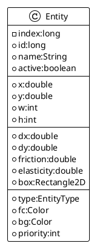

# The Entity

The game object for our game attempt is nothing else than an `Entity` class.

## The class

Simple POJO, the `Entity` class will sustain some important attributes for geometry, physics, and rendering values.

In terms of geometry, _position_ and _size_ are the basic ones.

For the _physic_ computation part, we will get _velocity_ and a _bounding box_ to manage collision.
And on the rendering purpose, we get _foreground_ and _background_ colors, a rendering _priority_
and a _type_ of `Entity`.



_figure 3.1 - the Entity class overview_

We still have some method in:  the `Entity#updateBox()` will take care to align bounding box with current position
and size.

```java
public static class Entity {
    //...
    double x, y;
    int w, h;
    //...
    Rectangle2D box = new Rectangle2D.Double();

    //...
    public void updateBox() {
        box.setFrame(x, y, w, h);
    }
    //...
}
```

## The Usage

To be able to add a simple Entity to the scene, you need to create a new instance  `<1>` of Entity and add it to the
entities list `<2>`:

```java
public class KarmaApp extends JPanel implements KeyListener {
    //...
    private final Map<String, Entity> entities = new ConcurrentHashMap<>();

    //...
    public void createScene() {
        // <1>
        Entity p = new Entity("player")
                .setPosition(160, 100)
                .setSize(16, 16)
                .setFriction(0.995)
                .setElasticity(0.45)
                .setBorderColor(new Color(0.0f, 0.0f, 0.6f, 1.0f))
                .setBackgroundColor(Color.BLUE)
                .setPriority(1)
                .addAttribute("speedStep", 0.15);
        // <2>
        addEntity(p);
    }

    //...
    private void addEntity(Entity e) {
        entities.put(e.name, e);
    }
    //...
}
```