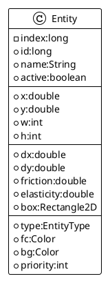

# The Entity

The game object for our game attempt is nothing else than an `Entity` class.

Simple POJO, the `Entity` class will sustain some important attributes for geometry, physics, and rendering values.

In terms of geometry, _position_ and _size_ are the basic ones.

For the _physic_ computation part, we will get _velocity_ and a _bounding box_ to manage collision.
And on the rendering purpose, we get _foreground_ and _background_ colors, a rendering _priority_
and a _type_ of `Entity`.



_figure 3.1 - the Entity class overview_

We still have some method in:  the `Entity#updateBox()` will take care to align bounding box with current position
and size.

```java
public static class Entity {
    //...
    double x, y;
    int w, h;
    //...
    Rectangle2D box = new Rectangle2D.Double();

    //...
    public void updateBox() {
        box.setFrame(x, y, w, h);
    }
    //...
}
```