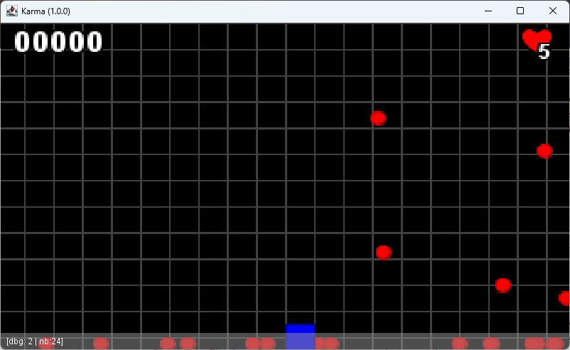

# Adding Text object

The basic `Entity` class is useful for dynamic objects that need to move on screen.
But we sometime need to display some text on screen! And this is where Text object will be used.

Want to show a score, a counter, a number of lives, text is often on famous HUD (Head Up Display)
of the platform/arcade games.

## Enhancing Entity

To let thing move, or not, we need to add a new attribute to our Entity, an info telling us if the `Entity`
is a static one (not moving one) or a dynamic one (constrained by some physic laws).

```java
public static class Entity {
    //...
    private PhysicType physicType;

    //...
    public Entity setPhysicType(PhysicType pt) {
        this.physicType = pt;
        return this;
    }

    public PhysicType getPhysicType() {
        return physicType;
    }
    //...
}
```

And the new enumeration will support three possible states:

- `NONE`, NOT constrained by AND NOT contributing to physical laws, the object is invisible by others
- `DYNAMIC`, Contributing AND constrained by physical laws, the object interacts with all the others,
- `STATIC` Contributing AND NOT constrained by physical laws. It Can be used as a static object in the scene that other
  objects will interact with.

```java
public enum PhysicType {
    NONE,
    STATIC,
    DYNAMIC;
}
```

So, in the `KarmaApp#update(long)` processing, we must take care of the physicType attribute value.

We may only process all the entities that are not of a `NONE` PhysicType `<1>`.

```java
public void update(long d) {
    entities.values().stream()
            // <1> Filter only STATIC and DYNAMIC entities
            .filter(e -> !e.getPhysicType().equals(PhysicType.NONE))
            .sorted(Comparator.comparingInt(Entity::getPriority))
            .forEach(e -> {
                applyPhysics(e, world, d);
                //...
            });
}
```

In the physical processing, only process required `DYNAMIC` entities `<2>`:

```java
private void applyPhysics(Entity e, World w, long d) {
    // <2> apply velocity computation on DYNAMIC entities
    if (e.getPhysicType().equals(PhysicType.DYNAMIC)) {
        e.x += e.dx * d;
        e.y += (e.dy + (w.getGravity() * 0.1)) * d;
        //...
    }
}
```

In the collision detection process, we filter only `STATIC` and `DYNAMIC` entities `<"3">`:

```java
    private void detectCollision(World w, Entity e) {
    entities.values().stream()
            .filter(
                    o -> e.isActive()
                            // <5> exclude NONE PhysicType entities.
                            && !o.getPhysicType().equals(PhysicType.NONE)
                            && o.isActive()
                            && !o.equals(e)).forEach(o -> {
                if (e.box.intersects(o.box) || e.box.contains(o.box)) {
                    e.dx = Math.max(o.dx, e.dx) * -Math.max(e.getElasticity(), o.getElasticity());
                    e.dy = Math.max(o.dy, e.dy) * -Math.max(e.getElasticity(), o.getElasticity());
                }
            });
}
```

And finally, into the play area constrain, only process `DYNAMIC` entities `<4>`:

```java
private void keepInPlayArea(World w, Entity e) {
    // <4> Contained to play area only DYNAMIC entity only
    if (e.getPhysicType().equals(PhysicType.DYNAMIC)) {
        Rectangle2D playArea = w.getPlayArea();
        if (!playArea.contains(e.box)) {
            if (e.x < playArea.getX()) {
                e.dx = e.dx * -e.getElasticity();
                e.x = playArea.getX();
            }
            //...
        }
    }
}
```

## Display now some text

the new class `TextObject` is extending Entity to inherit from it, and add some new attributes:

```java
public static class TextObject extends Entity {
    private String text;
    private Color textColor;
    private float fontSize = 10.0f;

    public TextObject(String name) {
        super(name);
        setPhysicType(PhysicType.NONE);
        this.textColor = Color.WHITE;
        this.text = "EMPTY";
    }

    public TextObject setText(String t) {
        this.text = t;
        return this;
    }

    public String getText() {
        return text;
    }

    public TextObject setTextColor(Color tc) {
        this.textColor = tc;
        return this;
    }

    public Color getTextColor() {
        return this.textColor;
    }

    public TextObject setFontSize(float fs) {
        this.fontSize = fs;
        return this;
    }

    public float getFontSize() {
        return fontSize;
    }
}
```

And to display this new entity, we need to enhance the `KarmaApp#draw()` method; according the nature of the entity
(its own class) we will draw it with a different method:

```java
public void draw() {
    //...  
    // Draw things
    entities.values().stream()
            .filter(Entity::isActive)
            .sorted(Comparator.comparingInt(Entity::getPriority))
            .forEach(e -> {
                switch (e.getClass().getSimpleName()) {
                    case "TextObject" -> {
                        drawTextObject((TextObject) e, g);
                    }
                    case "Entity" -> {
                        drawEntity(e, g);
                    }
                }
                //...
            });
    //...
}
```

We moved the Entity drawing process into the `drawEntity()` method and create the new `drawTextObject()`

```java
private static void drawTextObject(TextObject to, Graphics2D g) {
    g.setColor(to.getTextColor());
    g.setFont(g.getFont().deriveFont(to.getFontSize()));
    g.drawString(to.getText(), (int) to.x, (int) to.y);
}
```

and create one object to test everything:

```java

public void createScene() {
    //...
    TextObject score = (TextObject) new TextObject("score")
            .setText("00000")
            .setFontSize(16)
            .setTextColor(Color.WHITE)
            .setPosition(16, 18)
            .setPhysicType(PhysicType.NONE);
    addEntity(score);
}
```

let's compile and run :


## Enhancing the TextObject

We can add new features to our TextObject, like a black border, and a text `format` to automatically define a formatting
text for the supported `value`,and a better draw control with a `font` attribute.

let's add nw attributes:

```java
public static class TextObject extends Entity {
    //...
    private Font font;
    private String format = "";
    private Object value;

    public TextObject setFont(Font f) {
        this.font = f;
        return this;
    }

    public Font getFont() {
        return font;
    }

    //...
    public TextObject setFormat(String f) {
        this.format = f;
        return this;
    }

    public String getFormat() {
        return format;
    }

    public TextObject setValue(Object v) {
        this.value = v;
        if (!this.format.equals("")) {
            this.text = String.format(this.format, value);
        }
        return this;
    }

    public Object getValue() {
        return value;
    }
}
```

now in the rendering process :

```java
private static void drawTextObject(TextObject to, Graphics2D g) {
    g.setFont(to.getFont());
    g.setColor(Color.BLACK);
    for (int dx = -1; dx < 2; dx++) {
        for (int dy = -1; dy < 2; dy++) {
            g.drawString(to.getText(), (int) to.x + dx, (int) to.y + dy);
        }
    }
    g.setColor(to.getTextColor());
    g.drawString(to.getText(), (int) to.x, (int) to.y);
}
```

And for our sample code, we add 2 new variables: `score` and `lives`.

```java
public class KarmaApp extends JPanel implements KeyListener {
    //...
    private int lives = 5;
    private int score = 0;
    //...
}
```

modify our existing `scoreTxt` and `lifeTxt` TextObject initialization :

First, initialize a new Font for the score `<1>`, then define the new font ,value and format for the score `<2>`
And then, create a second smaller font for the number of remaining lives `<3>`, and set everything `<4>`

```java
public void createScene() {
    //...
    // Add a HUD score display
    // <1>
    Font fsc = buffer.createGraphics().getFont().deriveFont(Font.BOLD, 18.0f);
    TextObject score = (TextObject) new TextObject("score")
            .setText("")
            // <2>
            .setValue(0)
            .setFormat("%05d")
            .setFont(fsc)
            .setTextColor(Color.WHITE)
            .setPosition(10, 18)
            .setPhysicType(PhysicType.NONE);
    addEntity(score);
    // <3>
    Font fl = buffer.createGraphics().getFont().deriveFont(Font.BOLD, 12.0f);
    TextObject livesTxt = (TextObject) new TextObject("lives")
            .setText("")
            // <4>
            .setValue(5)
            .setFormat("%d")
            .setFont(fl)
            .setTextColor(Color.WHITE)
            .setPosition(resSize.width - 20, 22)
            .setPhysicType(PhysicType.NONE)
            .setPriority(2);
    addEntity(livesTxt);

    //...
}
```

We also will adapt the update method:

```java
    public void update(long d) {
    //...
    ((TextObject) entities.get("lives")).setValue(lives);
    ((TextObject) entities.get("score")).setValue(score);
}
```

Compile and run !

