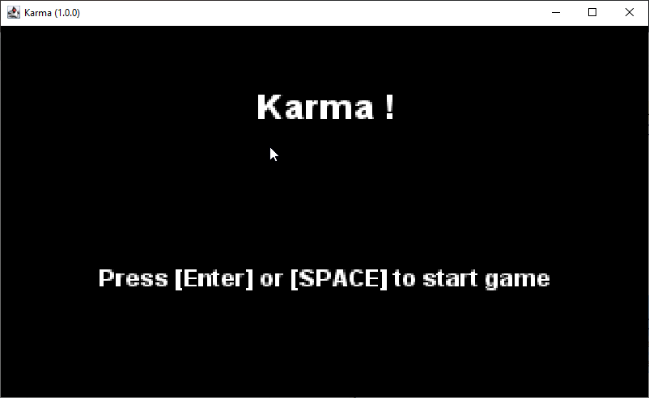
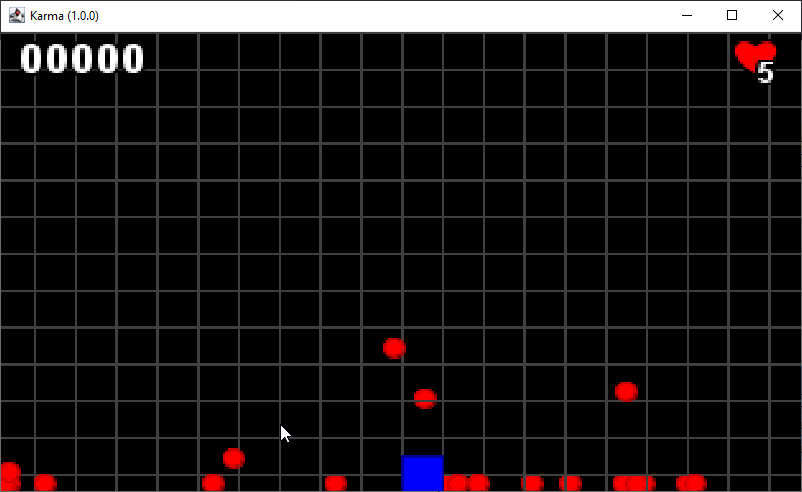

# The Scene

When it comes to building a game, there are multiple steps im its scenery.
You start the game, and it appears on the Title screen, then you navigate to some menu to start
the adventure, the game screen opens, and you play sometime, until you lost or were killed inm the game.

Each of those states contains different play type. If you want to implement all of these, the complexity may
raise too much.

The best way to solve this complexity is to split each level into subprograms.

This is where, like in a movie, we will use some scenes!

## Scene interface

Now we have a way to go,let's standardize the way we will implement a state: a `Scene`.

```java
public interface Scene {
    // <1>
    String getTitle();

    // <2>
    void create(KarmaPlatform app);

    // <3>
    void initialize(KarmaPlatform app);

    // <4>
    void input();

    // <5>
    void update(KarmaPlatform app, long d);

    // <6>
    void draw(KarmaPlatform app, Graphics2D g);

    // <7>
    void dispose(KarmaPlatform app);

    // <8>
    Collection<Entity> getEntities();

    Entity getEntity(String entityName);

    void clearEntities();
}
```

1. a `Scene` have a title, a human thing to identify it,
2. `create` to build the `Scene`,
3. `initialize` to setup (or reset) everything in the `Scene`,
4. `input` to let's interact player with some scene object,
5. `update` to define specific update mechanism du to the `Scene`, e.g., managing menu component interaction,
6. `draw` anything about `Scene` required things but `Entity` standard update.
7. `dispose` at the end of the `Scene`, before switching to another `Scene`.
8. anything about managing internal new entities.

## SceneManager to rule'em all

As we now have a Scene interface, we need a manager to create, activate, deactivate and or close them.

```java
public static class SceneManager {
    // <1>
    private KarmaPlatform app;
    private Scene current;
    private Map<String, Scene> scenes = new HashMap<>();

    // <2>
    public SceneManager(KarmaPlatform app) {
        this.app = app;
    }

    // <3>
    public void add(Scene scene) {
        this.scenes.put(scene.getTitle(), scene);
    }

    // <4>
    public void start() {
        if (Optional.ofNullable(current).isEmpty()) {
            start("init");
        }
    }

    public void start(String sceneName) {
        if (Optional.ofNullable(current).isEmpty() || !current.getTitle().equals(sceneName)) {
            this.current = scenes.get(sceneName);
        }
        this.current.clearEntities();
        this.current.create(app);
        this.current.initialize(app);
    }

    // <5>
    public void activate(String name) {
        if (Optional.ofNullable(this.current).isPresent()) {
            this.current.dispose(app);
        }
        start(name);
    }

    public Scene getCurrent() {
        return this.current;
    }
} 
```

1. All the internal attributes, the current parent application, the current active scene, and the list of scenes.
2. A default constructor to initialize the internal parent app reference,
3. a way to add a scene to the manager,
4. two `Scene` starters: one with a default "init" one and another by providing the required scene,
5. this is the good way to activate a `Scene` on its name,

The `AbstractScene` will help us to support entities into a `Scene`.

## The AbstractScene to manage entities

The `AbstractScene` is an abstract class implementing partially the `Scene` interface and also support all the `Entity`
management operation for that `Scene`.

```java
public abstract class AbstractScene implements KarmaPlatform.Scene {
    //<1>
    private final Map<String, KarmaPlatform.Entity> entities = new ConcurrentHashMap<>();
    private final KarmaPlatform.World world;

    //<2>
    public AbstractScene(KarmaPlatform app) {
        this.world = app.getWorld();
    }

    //<3>
    protected void addEntity(KarmaPlatform.Entity e) {
        entities.put(e.name, e);
    }

    public void clearEntities() {
        entities.clear();
    }

    public KarmaPlatform.Entity getEntity(String name) {
        return entities.get(name);
    }

    public Collection<KarmaPlatform.Entity> getEntities() {
        return entities.values();
    }

    // <4>
    public KarmaPlatform.World getWorld() {
        return this.world;
    }

}
```

1. the internal list of entities and the `World` object for this `Scene`,
2. the `World` object is by default initialized with parent application one,
3. everything about `Entity`, add, clear and getters,
4. retrieve the `Scene`'s `World` instance.

## Usage into KarmaPlatform

Now we defined some Scene interface, an Abstract layer to support Entity management, we can now implment SceneManager
usage into the KarmaPlatform class.

We can remove the entities and the world attributes from the `KarmaPlatform`.

And now initialize the `SceneManager`:

```java
private void init(String[] args) {
    //...
    sceneManager = new SceneManager(this);
    sceneManager.add(new TitleScene(this));
    sceneManager.add(new PlayScene(this));
}
```

For our demonstration purpose, we here create two new `Scene` implementations, a _title_ and a _play_ scenes.

And at first operation of the loop :

```java
private void loop() {
    sceneManager.start("title");
    //...
}
```

And on each of the 3 main loop operations in the `KarmaPlatform` class:

```java
public void input() {
    // <1>
    sceneManager.getCurrent().input(this);
}

public void update(long d) {
    // <2>
    Collection<Entity> entities = sceneManager.getCurrent().getEntities();
    //...
    // <3>
    sceneManager.getCurrent().update(this, d);
}

public void draw() {
    // prepare rendering pipeline
    Graphics2D g = buffer.createGraphics();
    //...
    // <4>
    Collection<Entity> entities = sceneManager.getCurrent().getEntities();
    //...
    // <5>
    sceneManager.getCurrent().draw(this, g);
    //...
}
```

1. Delegate input management to the current `Scene` implementation,
2. retrieve the current scene entities to update them all,
3. delegate specific update processing to the current active `Scene`,
4. Retrieve the current active `Scene` entities to draw them all,
5. delegate some specific supplementary drawing activities to the current active `Scene`.

## The Scenes

We are going to modify a little the play by creating two scenes:

- one to welcome the player a `TitleScene`
- and a second one with the game itself, the `PlayScene`.

As these scenes are specific to our demo, We will implement it outside the bif KarmaPlatform class, and in
a `my.karma.app.scenes` package.

### The title screen

The title screen is implemented into the `TitleScene` class.

Only simple operations here like display a title and a message to the player to start the game,
and an input detection of any key press on <kbd>ENTER</kbd> or <kbd>SPACE</kbd> keys.

1. Default Scene constructor
2. feed the name of this scene to retrieve it from the `SceneManager` POV,
3. Create the scene by adding some `TextObject` for _title_ and _message_,
4. Detect the corresponding input to switch to next `Scene`, the "play" one.

```java
public class TitleScene extends AbstractScene {
    // <1>
    public TitleScene(KarmaPlatform app) {
        super(app);
    }

    // <2>
    @Override
    public String getTitle() {
        return "title";
    }

    // <3>
    @Override
    public void create(KarmaPlatform app) {
        Font fl = app.getGraphics().getFont().deriveFont(Font.BOLD, 18.0f);
        String titleMsg = app.getMessage("app.main.title");
        int titleWidth = app.getGraphics().getFontMetrics().stringWidth(titleMsg);
        KarmaPlatform.TextObject titleTxt = (KarmaPlatform.TextObject) new KarmaPlatform.TextObject("title")
                .setText(titleMsg)
                .setFont(fl)
                .setTextColor(Color.WHITE)
                .setPosition((int) ((app.getScreenSize().width - titleWidth) * 0.46), (int) (app.getScreenSize().height * 0.25))
                .setPhysicType(KarmaPlatform.PhysicType.NONE)
                .setPriority(1);
        addEntity(titleTxt);

        Font flMsg = app.getGraphics().getFont().deriveFont(Font.BOLD, 12.0f);
        String startMsg = app.getMessage("app.main.start");
        int startWidth = app.getGraphics().getFontMetrics().stringWidth(startMsg);
        KarmaPlatform.TextObject startTxt = (KarmaPlatform.TextObject) new KarmaPlatform.TextObject("startMessage")
                .setText(startMsg)
                .setFont(flMsg)
                .setTextColor(Color.WHITE)
                .setPosition((int) ((app.getScreenSize().width - startWidth) * 0.46), (int) (app.getScreenSize().height * 0.70))
                .setPhysicType(KarmaPlatform.PhysicType.NONE)
                .setPriority(1);
        addEntity(startTxt);
    }

    // <4>
    @Override
    public void input(KarmaPlatform app) {
        if (app.isKeyPressed(KeyEvent.VK_ENTER) || app.isKeyPressed(KeyEvent.VK_SPACE)) {
            app.getSceneManager().activate("play");
        }
    }
}
```

### The game screen

The PlayScene is mostly an extract of the previous KarmaPlatform implementation from the create and input method,
moving their content to the new `PlayScene` class:

1. here are the required attributes for this scene, the _score_ and the _lives_ number,
2. And the internal name for this scene

```java
public class PlayScene extends AbstractScene {
    // <1>
    private int lives = 5;
    private int score = 0;

    //...
    // <2>
    @Override
    public String getTitle() {
        return "play";
    }
    //...
}
```

Then we need to copy/past the create method body from the KarmaPlatform:

1. Create all the required Entity and objects
2. Add a new GridObject to render the checker background only on this scene (TitleScene does not need it).

```java

@Override
public void create(KarmaPlatform app) {
    // <1>
    // Add a player.
    KarmaPlatform.Entity p = new KarmaPlatform.Entity("player")
            .setPosition(160, 100)
            .setSize(16, 16)
            .setFriction(0.995)
            .setElasticity(0.45)
            .setBorderColor(new Color(0.0f, 0.0f, 0.6f, 1.0f))
            .setBackgroundColor(Color.BLUE)
            .setPriority(1)
            .addAttribute("speedStep", 0.15);
    addEntity(p);

    //...

    // <2>
    KarmaPlatform.GridObject go = (KarmaPlatform.GridObject) new KarmaPlatform.GridObject("grid")
            .setPriority(-10)
            .setBorderColor(Color.DARK_GRAY);
    addEntity(go);
}
```

In the Input method, we must manage the key pressed events for player moves:

```java

@Override
public void input(KarmaPlatform app) {
    KarmaPlatform.Entity p = getEntity("player");

    double speedStep = p.getAttribute("speedStep");

    if (app.isKeyPressed(KeyEvent.VK_UP)) {
        p.dy = -speedStep;
    }
    if (app.isKeyPressed(KeyEvent.VK_DOWN)) {
        p.dy = speedStep;

    }
    if (app.isKeyPressed(KeyEvent.VK_LEFT)) {
        p.dx = -speedStep;
    }
    if (app.isKeyPressed(KeyEvent.VK_RIGHT)) {
        p.dx = speedStep;
    }
    // process all input behaviors
    getEntities().stream().filter(e -> e.isActive()).forEach(e -> {
        if (!e.getBehaviors().isEmpty()) {
            e.getBehaviors().forEach(b -> {
                b.onInput(app, e);
            });
        }
    });
}
```

And finally, we will update the score and lives display entities according to the corresponding class attributes:

```java

@Override
public void update(KarmaPlatform app, long d) {
    ((KarmaPlatform.TextObject) getEntity("lives")).setValue(lives);
    ((KarmaPlatform.TextObject) getEntity("score")).setValue(score);
}
```

## Let's run it

Recompile everything and execute these new classes:



_figure 5.1—The TitleScene displaying title_



_figure 5.2—The PlayScene to play with_

