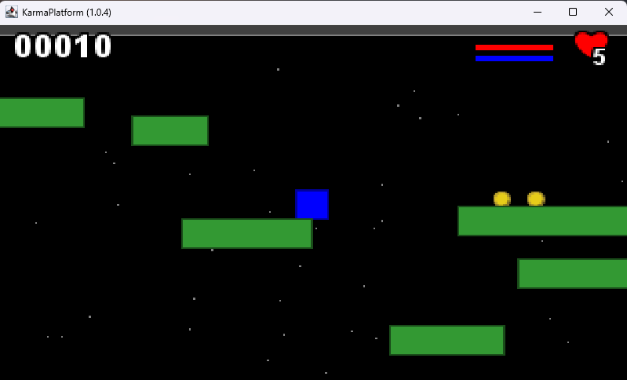

# Add particle behavior

While we already add `Behavior` to our `Entity` and add child's Entity list to any `Entity`, we are ready to go further
with new animation possibilities: add particle behaviors.

## What is a particle?

A _particle_ is the smallest element from a particle system that be animated by a common behavior shared bay all the
particles of a system.

In our case, the particle system will be an `Entity`,and the particles of that system will be its child.

Basically, the particle is created, lives a certain period of time, and then disappears.

In our Entity, we already have the base mechanism to manage the period of time the entity is active:
the duration attribute.

To be able to create a particle from an Entity, we are just missing a specific `Behavior.onCreate()` to define the
right operation to create a new particle in the system.

## The ParticleBehavior interface

As described before, we are missing the onCreate API, so here it is :

<figure>

<figcaption>figure 11.1 - The <code>ParticleBehavior</code> interface inheriting from the <code>Behavior</code> already existing interface</figcaption></figure>

Here is the possible interface definition:

```java
    public interface ParticleBehavior<Entity> extends Behavior<Entity> {
    default void onCreate(KarmaPlatform a, Entity e) {
    }
}
```

It is time for a simple first implementation: a background star field.

## A star field particle system

What is a star field?

A star field is a bunch of stars in a dynamic sky, moving accordingly to the opposite of the Camera moves,
on some multiple parallax.

Those parallax will be some computation based on the priority of each child Entity multiplied by a specific factor.

The `StarFieldParticleBehavior` is the implementation for the Star animation.

```java
public class StarFieldParticleBehavior implements KarmaPlatform.ParticleBehavior<KarmaPlatform.Entity> {
    private int nbStars;
    private KarmaPlatform.Entity focusEntity;
    private double speedRatio;
    private double starSpread;
}
```

The class contains the following attributes :

- `nbStars` the number of stars to be displayed on the play area,
- `focusEntity` is the `Entity` focused as a target of the star field movement,
- `speedRatio` the ratio to be applied on the target velocity, 
- `starSpread` 


!! TODO add a diagram there

<figure>

<figCaption>figure 11.2 - Some stars in the background</figCaption>
</figure>